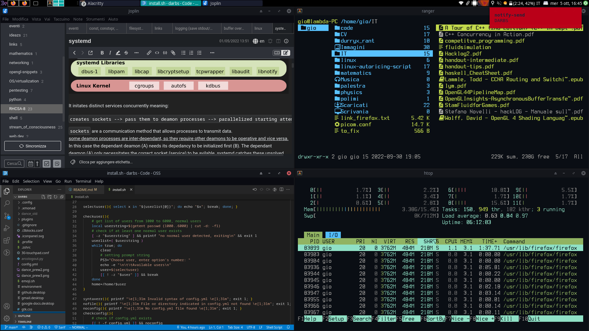
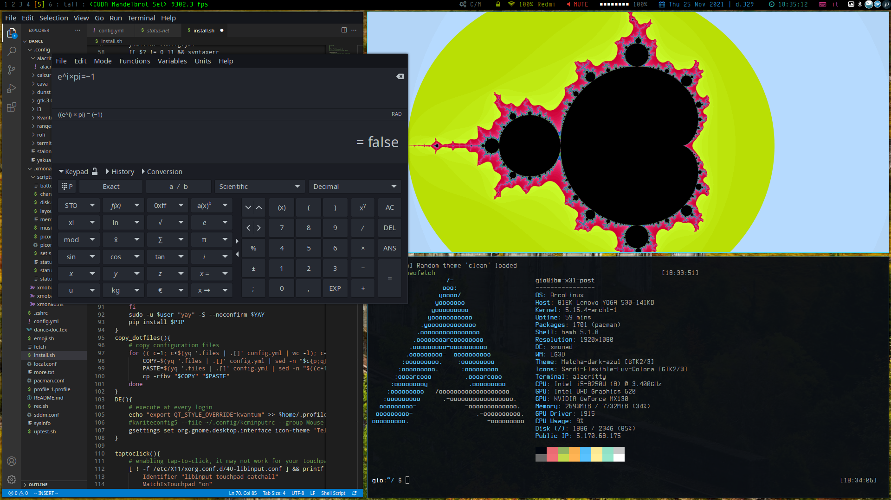

# Durryx auto-ricing bootstrapping script
DARBS is collection of scripts that automatically installs a minimal riced version of XFCE and Xmonad with some other essential software. Currently the supported linux ditros are: Arch.
## Images
[comment]: <> (add a photo with music script, nvidia mode, overleaf and moti PDF)


## Installation
If git is not installed install it with `sudo pacman -S git` then:
```
$ git clone https://github.com/durryx/linux-autoricing-script
$ cd linux-autoricing-script
$ sudo script -c install.sh -O logfile.txt
# analyze the script's behaviour with `cat logfile.txt` a capture of stdout during execution
```
If, before executing the script, you want to add or remove some packages to install just edit `config.yml`, it's quite easy to read. If you add some dotfiles you need to specify them in the files section of config.yml, first put the file or directory's name and after it's destination. Your previous dotfiles won't be deleted, a in-place backup will be performed.
